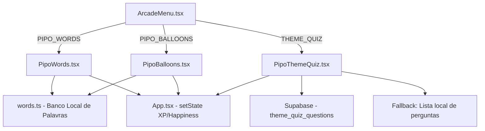

# Jogos Educativos no Arcade do Pipo

Substituição dos jogos `Pipo-Man` e `Pipo-Worms` por 3 jogos educativos de inglês adaptados ao nível do usuário.

---

## Arquitetura dos Componentes



### Fluxo de Dados

1. **ArcadeMenu** dispara `onGameSelect('PIPO_WORDS' | 'PIPO_BALLOONS' | 'THEME_QUIZ')`.
2. **App.tsx** renderiza o componente correspondente em um `<AnimatePresence>` fullscreen (z-index 50+).
3. Cada jogo recebe `englishLevel` como prop e seleciona palavras/perguntas adequadas.
4. Ao finalizar, cada jogo chama `onClose(score)` → App.tsx calcula XP, atualiza `setState`, e dispara `setMessage`.

### Props dos Componentes

```typescript
// PipoWords
interface PipoWordsProps {
  englishLevel: number;
  onClose: (score: number) => void;
}

// PipoBalloons
interface PipoBalloonsProps {
  englishLevel: number;
  onClose: (score: number) => void;
}

// PipoThemeQuiz
interface PipoThemeQuizProps {
  englishLevel: number;
  userId: string;
  onClose: (score: number) => void;
}
```

### Banco de Palavras (words.ts)

```typescript
// src/constants/words.ts
export const WORD_BANK = {
  // Nível 1-3: 4 letras
  beginner: [
    { word: 'BIRD', hint: 'Pássaro' },
    { word: 'FISH', hint: 'Peixe' },
    { word: 'DOOR', hint: 'Porta' },
    // ... ~80 palavras
  ],
  // Nível 4-10: 5 letras
  intermediate: [
    { word: 'APPLE', hint: 'Maçã' },
    { word: 'HOUSE', hint: 'Casa' },
    // ... ~100 palavras
  ],
  // Nível 11+: 6 letras
  advanced: [
    { word: 'BANANA', hint: 'Banana' },
    { word: 'FAMILY', hint: 'Família' },
    // ... ~80 palavras
  ]
};
```

---

## Estética e Design Visual

> Todos os jogos seguem o **Design System Pixel-Art do Pipo**: formas retangulares sem border-radius, bordas grossas pretas (`border-4 border-black`), sombras hard-pixel (`shadow-[4px_4px_0px_0px_rgba(0,0,0,1)]`), texto uppercase bold micro (`text-[8px]` a `text-[12px]`), e animações via `motion/react`.

---

## 1. Pipo-Words (Adivinhe a Palavra)

**Conceito:** O clássico jogo de dedução de palavras (estilo Wordle), integrado com o nível de proficiência em inglês do usuário.

**Mecânica:**
- O usuário tem 6 tentativas para adivinhar uma palavra em inglês.
- O tamanho da palavra escala com o nível do usuário:
  - Níveis 1 a 3: Palavras de 4 letras (Ex: DOOR, FISH, BIRD).
  - Níveis 4 a 10: Palavras de 5 letras (Ex: APPLE, SMART, HOUSE).
  - Níveis > 10: Palavras de 6 letras ou mais (Ex: BANANA, RANDOM).
- Feedback visual de cores (Verde, Amarelo e Cinza).
- Dica: O jogo exibirá uma "tradução" oculta como dica se o usuário gastar 10 pontos de energia do Pipo.

**Recompensas (XP):**
- Acertar na 1ª tentativa: +50 XP
- Acertar na 2ª tentativa: +40 XP
- ... e assim por diante. Mínimo de +10 XP.
- Aumenta a "Felicidade" do Pipo significativamente.

### Layout (mobile-first, fullscreen overlay)

```
┌─────────────────────────────┐
│  ← PIPO-WORDS    Nível 3   │  ← Header preto, texto branco
├─────────────────────────────┤
│                             │
│   ┌───┐ ┌───┐ ┌───┐ ┌───┐  │  ← Grid de tentativas (6 linhas)
│   │ H │ │ O │ │ U │ │ S │  │     Cada célula: 48x48px
│   └───┘ └───┘ └───┘ └───┘  │     border-4 border-black
│   ┌───┐ ┌───┐ ┌───┐ ┌───┐  │     bg-green-500 = posição certa
│   │   │ │   │ │   │ │   │  │     bg-yellow-400 = letra certa, posição errada
│   └───┘ └───┘ └───┘ └───┘  │     bg-gray-400 = letra errada
│        ... (6 linhas)       │
│                             │
│  💡 Dica: "Onde você mora"  │  ← Botão de dica (custa 10 energia)
│                             │
│  ┌─┐┌─┐┌─┐┌─┐┌─┐┌─┐┌─┐    │  ← Teclado virtual pixel-art
│  │Q││W││E││R││T││Y││U│    │     3 linhas, botões quadrados
│  └─┘└─┘└─┘└─┘└─┘└─┘└─┘    │     Teclas mudam de cor ao usar
│  ┌─┐┌─┐┌─┐┌─┐┌─┐┌─┐┌─┐    │     (verde/amarelo/cinza)
│  │A││S││D││F││G││H││J│    │
│  └─┘└─┘└─┘└─┘└─┘└─┘└─┘    │
│  ┌──┐┌─┐┌─┐┌─┐┌─┐┌─┐┌──┐  │
│  │⏎ ││Z││X││C││V││B││⌫ │  │
│  └──┘└─┘└─┘└─┘└─┘└─┘└──┘  │
└─────────────────────────────┘
```

### Paleta de Cores
- Fundo: `bg-[#f5f5f0]` (tom creme do app)
- Célula correta: `bg-green-500` com `border-green-700`
- Célula parcial: `bg-yellow-400` com `border-yellow-600`
- Célula errada: `bg-gray-400` com `border-gray-600`
- Célula vazia: `bg-white` com `border-black`

### Animações
- Ao submeter: cada célula faz um `flip` sequencial (rotateX 0→90→0) revelando a cor.
- Vitória: confete pixel-art + Pipo mini aparece dançando no topo.
- Derrota: tela treme (`shake`) + palavra correta aparece em vermelho.

---

## 2. Pipo-Balloons (O Jogo da Forca Amigável)

**Conceito:** Uma adaptação infantil e amigável do tradicional jogo da "Forca" (Hangman). Em vez de uma figura sendo enforcada, o Pipo está segurando 6 balões de gás hélio.

**Mecânica:**
- O usuário deve adivinhar uma palavra oculta sugerindo letras (A-Z).
- Se a letra existir na palavra, ela é revelada nas posições corretas.
- Se a letra **não** existir na palavra, o Pipo perde 1 balão.
- Fim de Jogo: Se o usuário errar 6 letras, o último balão estoura e o jogo termina.
- A palavra pode vir com a tradução ou categoria como "dica" dependendo do nível.

**Recompensas (XP):**
- Vitória sem perder nenhum balão: +30 XP
- Vitória perdendo alguns balões: +15 XP
- Ajuda a manter a Energia e Felicidade do Pipo em alta.

### Layout (mobile-first, fullscreen overlay)

```
┌─────────────────────────────┐
│  ← PIPO-BALÕES   Nível 3   │
├─────────────────────────────┤
│                             │
│      🔴🟡🟢🔵🟣🟠          │  ← 6 balões pixel-art (divs CSS)
│         \|/                 │     Cada erro → 1 balão estoura
│         🐹                  │     com animação POP (scale→0)
│        /Pipo\               │     e partículas
│                             │
│   ┌─┐ ┌─┐ ┌─┐ ┌─┐ ┌─┐     │  ← Palavra oculta
│   │H│ │_│ │_│ │S│ │_│     │     Células com letras reveladas
│   └─┘ └─┘ └─┘ └─┘ └─┘     │     border-4, bg-white
│                             │
│  Dica: "Animal doméstico"   │  ← Categoria/tradução
│                             │
│  ┌─┐┌─┐┌─┐┌─┐┌─┐┌─┐┌─┐    │  ← Teclado A-Z
│  │A││B││C││D││E││F││G│    │     Letras já usadas ficam
│  └─┘└─┘└─┘└─┘└─┘└─┘└─┘    │     desabilitadas (opacity-30)
│  ┌─┐┌─┐┌─┐┌─┐┌─┐┌─┐┌─┐    │     Acerto = bg-green-400
│  │H││I││J││K││L││M││N│    │     Erro = bg-red-400
│  └─┘└─┘└─┘└─┘└─┘└─┘└─┘    │
│  ┌─┐┌─┐┌─┐┌─┐┌─┐┌─┐┌─┐    │
│  │O││P││Q││R││S││T││U│    │
│  └─┘└─┘└─┘└─┘└─┘└─┘└─┘    │
│  ┌─┐┌─┐┌─┐┌─┐┌─┐          │
│  │V││W││X││Y││Z│          │
│  └─┘└─┘└─┘└─┘└─┘          │
└─────────────────────────────┘
```

### Os Balões (CSS Pixel-Art)
- 6 balões coloridos desenhados com divs (sem emoji, controle visual total):
  - Corpo: `w-10 h-12` quadrado pixelado com cor vibrante
  - Fio: `w-[2px] h-8 bg-black`
- Animação idle: cada balão faz `y: [0, -5, 0]` com delays diferentes (flutuação).
- Ao errar: o balão mais à direita faz `scale: [1, 1.3, 0]` + `opacity: [1, 1, 0]` → some.
- O Pipo fica abaixo segurando os fios. Quando balões somem, ele fica triste (olhos mudam).

### Animações
- Acerto de letra: célula pulsa `scale: [1, 1.2, 1]` em verde.
- Erro de letra: tela treme sutil + balão estoura com partículas.
- Vitória: Pipo salta + confete + balões restantes voam para cima.
- Derrota: Pipo fica triste, palavra aparece em vermelho.

---

## 3. Pipo Millionaire Quiz (Show do Milhão)

**Conceito:** O formato clássico de "Quem Quer Ser um Milionário / Show do Milhão", adaptado para o aprendizado de inglês por imersão. As perguntas são de conhecimento geral, totalmente em inglês, e a dificuldade escala a cada rodada.

**Mecânica:**
1. **Escada de Prêmios:** O jogo tem 10 perguntas. O XP ganho aumenta a cada pergunta certa (ex: 5, 10, 20, 50, 100...).
2. **Risco e Recompensa:** 
   - A qualquer momento o jogador pode clicar em **Parar** (leva todo o XP acumulado).
   - Se **Errar**, ele perde a maior parte do que acumulou (ou cai para o último patamar seguro).
3. **Lifelines (Ajudas):** O usuário possui 3 ajudas que só podem ser usadas **1 vez por partida**:
   - `50:50` (Meio a Meio): Remove 2 opções erradas.
   - `Ask Audience` (Platéia): Mostra um gráfico de barras com a probabilidade de cada resposta, sendo a certa a que tem a maior barra.
   - `Skip` (Pular): Pula a pergunta atual e sorteia uma nova.
4. **Did You Know:** Assim como no modo anterior, após confirmar a resposta, uma curiosidade ("Did You Know?") em inglês é mostrada para reforçar o aprendizado.

**Recompensas (XP):**
| Pergunta | Recompensa Acumulada |
|---|---|
| 1 | 5 XP |
| 2 | 10 XP |
| ... | ... |
| 10 | 500 XP (Prêmio Máximo) |

### Layout – Tela de Pergunta (Show do Milhão)

```
┌─────────────────────────────┐
│  💰 PIPO MILLIONAIRE       │
├─────────────────────────────┤
│  [50:50]  [👥 Ask]  [⏭️ Skip]│  ← 3 Ajudas (Lifelines)
├─────────────────────────────┤
│  ┌─────────────────────┐    │
│  │  Which dog breed is │    │  ← Pergunta de CONHECIMENTO
│  │  considered the     │    │     em inglês
│  │  smartest?          │    │
│  └─────────────────────┘    │
│                             │
│  ┌─────────────────────┐    │  ← 4 opções de resposta
│  │  A) Bulldog         │    │     
│  └─────────────────────┘    │
│  ┌─────────────────────┐    │
│  │  B) Border Collie   │    │  
│  └─────────────────────┘    │
│  ┌─────────────────────┐    │
│  │  C) Poodle          │    │
│  └─────────────────────┘    │
│  ┌─────────────────────┐    │
│  │  D) Chihuahua       │    │
│  └─────────────────────┘    │
│                             │
│   [ 🛑 PARAR (Leva 20 XP) ] │  ← Botão de desistência
└─────────────────────────────┘
```

### Animações Clássicas
- **Tensão:** Ao clicar em uma resposta, ela fica `laranja/amarela` e pisca 2 vezes. Um som de "suspense" toca. Após 2 segundos, a resposta fica `verde` (se certa) ou `vermelha` (se errada).
- **Ajudas:** O `50:50` esmaece duas opções. O `Ask Audience` faz surgir um popup com as barras do gráfico subindo.
- **Vitória:** Efeitos de confete, pisca-pisca e a escada de prêmios subindo.
- **Derrota:** Som de decepção ("Aaaaw"), a opção certa acende em verde, e a tela de Game Over exibe o XP restante e a opção "Jogar Novamente".

---

## Alterações Necessárias nos Arquivos

| Arquivo | Ação | Descrição |
|---|---|---|
| `src/constants/words.ts` | **NOVO** | Banco de palavras local (beginner/intermediate/advanced) |
| `src/components/ArcadeMenu.tsx` | **MODIFICAR** | Remover PIPOMAN e WORMS, adicionar 3 novos botões |
| `src/App.tsx` | **MODIFICAR** | Remover imports/renders antigos, adicionar novos jogos |
| `src/components/games/PipoWords.tsx` | **NOVO** | Jogo de dedução de palavras |
| `src/components/games/PipoBalloons.tsx` | **NOVO** | Jogo da forca amigável com balões |
| `src/components/games/PipoThemeQuiz.tsx` | **NOVO** | Quiz temático com seleção de assunto e dicas |
